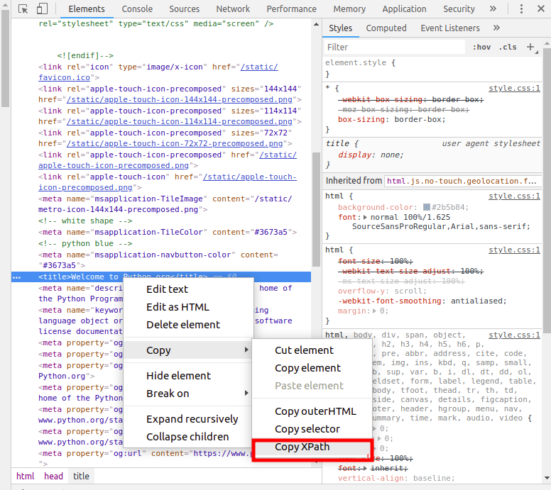

## Description
This library allows you to recursively extract information from online sites with XPath

## How to install
```
python -m pip install git+https://github.com/mainmaster/easyparser
```

## How to use

Find your XPath in browser:



read more about [XPath](https://en.wikipedia.org/wiki/XPath)

``` python
from easyparser import find_recursive

# find titles
for title in find_recursive(url, "/html/head/title/text()"):
    ...

# find images
for img in find_recursive(url, "//img/@src"):
    ...

# ignore urls (aka black list)
ignore = ["https://some-site.com/foo/bar"]
for _ in find_recursive(url, path, ignore=ignore):
    ...

# accept urls (aka white list)
for _ in find_recursive(url, path, accept=[url]):
    ...
# last will disable recursive mechanic though
```

